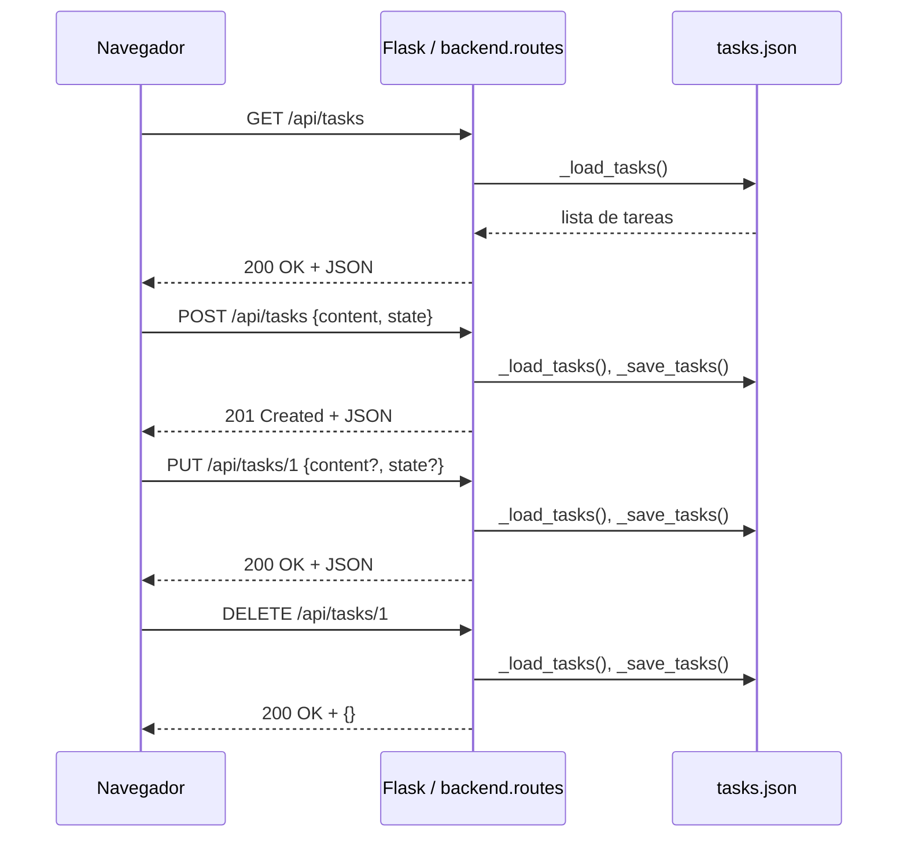

# Visión General del Proyecto

Kanban Mini‑Trello es una aplicación ligera que permite gestionar tareas en un tablero Kanban con tres columnas: **Por Hacer**, **En Progreso** y **Hecho**.  
El backend está construido sobre Flask y persiste los datos en un archivo `tasks.json`. El frontend, a su vez, utiliza Bootstrap 5 para el estilo y JavaScript puro para la interacción (drag‑and‑drop, edición inline y creación de tareas).  

Los usuarios pueden:

- **Crear** nuevas tareas con contenido libre.
- **Editar** el texto de una tarea haciendo clic sobre él.
- **Mover** las tareas entre columnas mediante arrastrar‑soltar.
- **Eliminar** tareas con un botón rojo.

La aplicación está pensada para ser desplegada como un único proceso que sirve tanto la API REST como los archivos estáticos del frontend.  

---

# Arquitectura del Sistema

## Estructura de Paquetes

```
project/
│
├── backend/
│   ├── __init__.py      # Crea y configura Flask, registra blueprints.
│   └── routes.py        # Endpoints CRUD + lógica de persistencia.
│
├── frontend/
│   └── index.html       # SPA con Bootstrap 5 y JS funcional.
│
├── tasks.json           # Persistencia simple en disco (lista JSON).
└── requirements.txt    # Dependencias: Flask, pytest.
```

## Flujo de Datos

1. **Cliente → API**  
   - Peticiones HTTP (`GET`, `POST`, `PUT`, `DELETE`) a `/api/tasks` o `/api/tasks/<id>`.
2. **API → Persistencia**  
   - `_load_tasks()` lee `tasks.json`.  
   - Operaciones CRUD modifican la lista en memoria y llaman a `_save_tasks()`.
3. **Persistencia → Cliente**  
   - Respuestas JSON con el estado actualizado.

## Diagrama Mermaid



---

# Endpoints de la API

| Método | Ruta | Descripción | Parámetros | Respuesta |
|--------|------|-------------|------------|-----------|
| `GET` | `/api/tasks` | Obtener todas las tareas. | N/A | `200 OK` <br> JSON: `[{id, content, state}]` |
| `POST` | `/api/tasks` | Crear una nueva tarea. | `content` (string) obligatorio<br>`state` (string) opcional (`Por Hacer`) | `201 Created` <br> JSON: `{id, content, state}` |
| `PUT` | `/api/tasks/<int:id>` | Actualizar contenido y/o estado de una tarea existente. | `content` (string) opcional<br>`state` (string) opcional | `200 OK` <br> JSON: `{id, content, state}`<br>`404 Not Found` si no existe |
| `DELETE` | `/api/tasks/<int:id>` | Eliminar una tarea por ID. | N/A | `200 OK` <br> JSON: `{}`<br>`404 Not Found` si no existe |

### Ejemplo de uso

```bash
# Crear
curl -X POST http://localhost:5000/api/tasks \
     -H "Content-Type: application/json" \
     -d '{"content":"Revisar PR", "state":"Por Hacer"}'

# Mover a otra columna
curl -X PUT http://localhost:5000/api/tasks/1 \
     -H "Content-Type: application/json" \
     -d '{"state":"En Progreso"}'
```

---

# Instrucciones de Instalación y Ejecución

1. **Clonar el repositorio**  
   ```bash
   git clone https://github.com/tu_usuario/kanban-mini-trello.git
   cd kanban-mini-trello
   ```

2. **Crear entorno virtual (opcional pero recomendado)**  
   ```bash
   python -m venv .venv
   source .venv/bin/activate  # Windows: .venv\Scripts\activate
   ```

3. **Instalar dependencias**  
   ```bash
   pip install -r requirements.txt
   ```

4. **Iniciar la aplicación**  
   ```bash
   export FLASK_APP=backend
   flask run
   ```
   La app estará disponible en `http://127.0.0.1:5000/`.

5. **Ejecutar pruebas**  
   ```bash
   pytest tests/
   ```

---

# Flujo de Datos Clave

1. **Carga inicial** (`loadTasks`)  
   - El navegador hace una petición `GET /api/tasks`.  
   - Se devuelve la lista completa que se almacena en la variable global `tasks`.

2. **Renderizado** (`renderAllTasks`)  
   - Filtra `tasks` por estado y crea tarjetas HTML para cada tarea.

3. **Edición inline** (`editTask`)  
   - Prompt del usuario → `PUT /api/tasks/<id>` con nuevo contenido.  
   - Actualiza la lista local y el DOM.

4. **Arrastrar‑soltar** (`handleDrop`)  
   - Al soltar, se envía `PUT /api/tasks/<id>` con el nuevo estado.  
   - Se vuelve a renderizar todas las columnas.

5. **Creación** (`addTask`)  
   - Prompt → `POST /api/tasks`.  
   - Añade la nueva tarea al array local y re‑renderiza.

6. **Eliminación** (`deleteTask`)  
   - Confirmación → `DELETE /api/tasks/<id>`.  
   - Filtra el array local y elimina el elemento del DOM.

---

# Extensiones Futuras (Opcional)

| Área | Idea | Beneficio |
|------|------|-----------|
| **Persistencia** | Migrar a una base de datos SQLite o PostgreSQL. | Escalabilidad, concurrencia y consultas más complejas. |
| **Autenticación** | Añadir JWT + login/logout. | Acceso controlado a tareas por usuario. |
| **Etiquetas / Prioridades** | Permitir asignar etiquetas y niveles de prioridad. | Mejor organización visual. |
| **WebSocket** | Implementar actualizaciones en tiempo real con Flask‑SocketIO. | Sincronización instantánea entre clientes. |
| **Testing** | Añadir tests de integración para el frontend (Cypress). | Garantizar calidad de UI. |

---