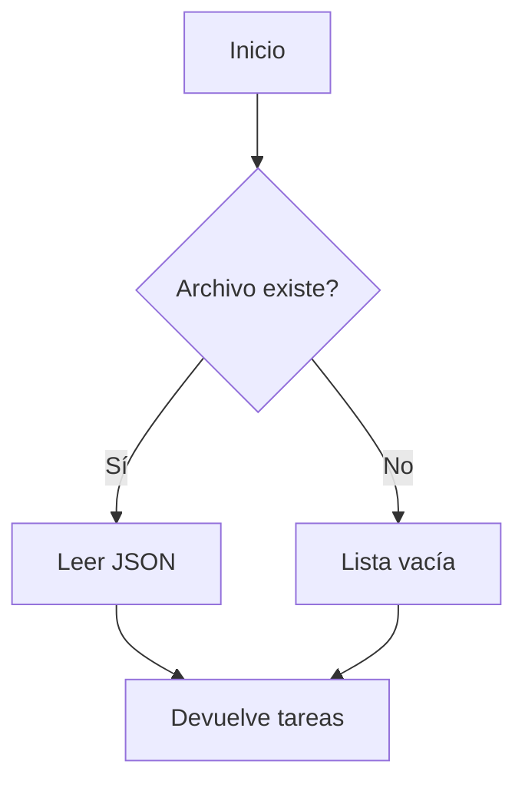
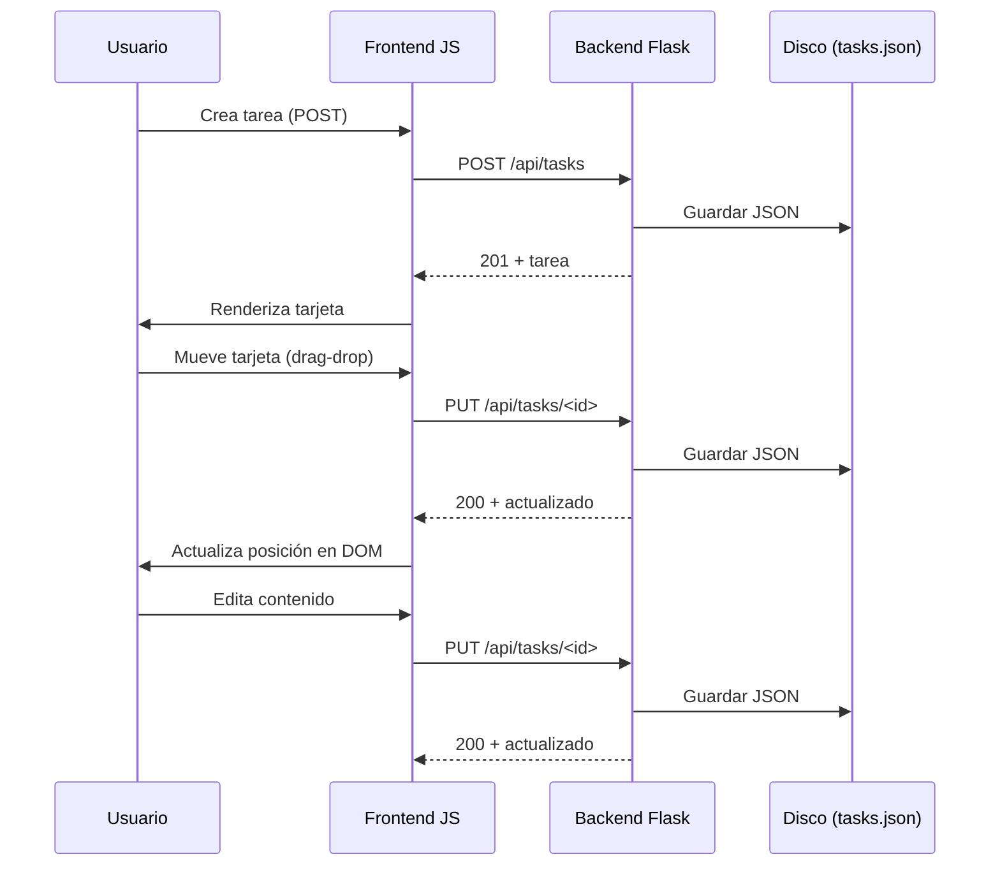

# Visión General del Proyecto

Kanban Mini‑Trello es una aplicación web ligera que permite gestionar tareas en un tablero Kanban con tres columnas: **Por Hacer**, **En Progreso** y **Hecho**.  
El backend está construido sobre Flask, expone una API RESTful simple para crear, leer, actualizar y eliminar tareas, y persiste los datos en un archivo JSON local. El frontend es una página HTML/JavaScript pura que consume esa API, renderiza las tarjetas y permite su edición drag‑and‑drop.

Los principales actores son:

| Rol | Responsabilidad |
|-----|-----------------|
| **Usuario** | Interactúa con la UI para crear, mover o editar tareas. |
| **Servidor Flask** | Gestiona la lógica de negocio, valida entradas y mantiene el estado en memoria y en disco. |
| **Archivo `tasks.json`** | Almacén persistente que contiene la lista de tareas. |

---

# Arquitectura del Sistema

## Estructura de Paquetes

```
backend/
├── __init__.py      # Factory y utilidades de archivo
├── routes.py        # Endpoints de tareas
└── app.py           # Punto de entrada
frontend/
└── index.html       # UI estática
requirements.txt     # Dependencias (Flask)
```

### Flujo de Inicialización

1. `app.py` importa y llama a `create_app()`.
2. `create_app()`:
   - Crea la instancia Flask.
   - Carga `tasks.json` en memoria (`current_app.config['TASKS']`).
   - Registra el blueprint `/api/tasks`.
   - Sirve `index.html` como recurso estático.

### Persistencia

- **Carga**: `_load_tasks(filepath)` lee el JSON, devuelve una lista vacía si falta o es inválido.
- **Guardado**: `_save_tasks(filepath, tasks)` escribe de forma atómica usando un archivo temporal y `os.replace`.



---

# Endpoints de la API

| Método | Ruta | Parámetros | Descripción | Respuesta |
|--------|------|------------|-------------|-----------|
| `GET`  | `/api/tasks` | - | Obtiene todas las tareas. | `200 OK` + JSON array |
| `POST` | `/api/tasks` | `{content, status?}` | Crea una tarea con ID autoincremental y estado por defecto *Por Hacer*. | `201 Created` + objeto tarea |
| `PUT`  | `/api/tasks/<int:task_id>` | `{content?, status?}` | Actualiza contenido o estado de la tarea. | `200 OK` + objeto actualizado |
| `DELETE` | `/api/tasks/<int:task_id>` | - | Elimina la tarea especificada. | `200 OK` + objeto eliminado |

### Ejemplo de Respuesta

```json
{
  "id": 3,
  "content": "Revisar PR",
  "status": "En Progreso"
}
```

---

# Instrucciones de Instalación y Ejecución

1. **Clonar el repositorio**  
   ```bash
   git clone https://github.com/tu_usuario/kanban-mini-trello.git
   cd kanban-mini-trello
   ```

2. **Crear entorno virtual (opcional pero recomendado)**  
   ```bash
   python3 -m venv .venv
   source .venv/bin/activate  # Windows: .\.venv\Scripts\activate
   ```

3. **Instalar dependencias**  
   ```bash
   pip install -r requirements.txt
   ```

4. **Iniciar el servidor**  
   ```bash
   python backend/app.py
   ```
   El servidor escuchará en `http://0.0.0.0:5000`.

5. **Acceder a la aplicación**  
   Navega a `http://localhost:5000` en tu navegador.

---

# Flujo de Datos Clave



---

# Extensiones Futuras (Opcional)

| Área | Posible Mejora |
|------|----------------|
| **Autenticación** | Añadir JWT o sesiones para usuarios autenticados. |
| **Persistencia en BD** | Migrar de JSON a SQLite/PostgreSQL usando SQLAlchemy. |
| **Notificaciones** | WebSocket (Flask‑SocketIO) para actualización en tiempo real entre clientes. |
| **Export/Import** | API para exportar tareas a CSV o importar desde otro formato. |
| **Testing** | Agregar tests unitarios y de integración con PyTest y Selenium. |

---