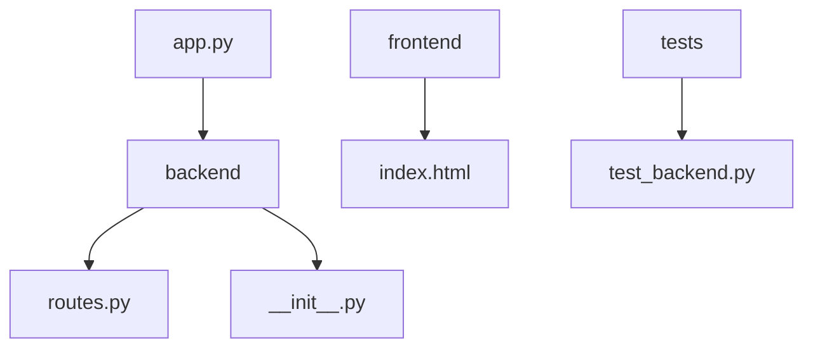
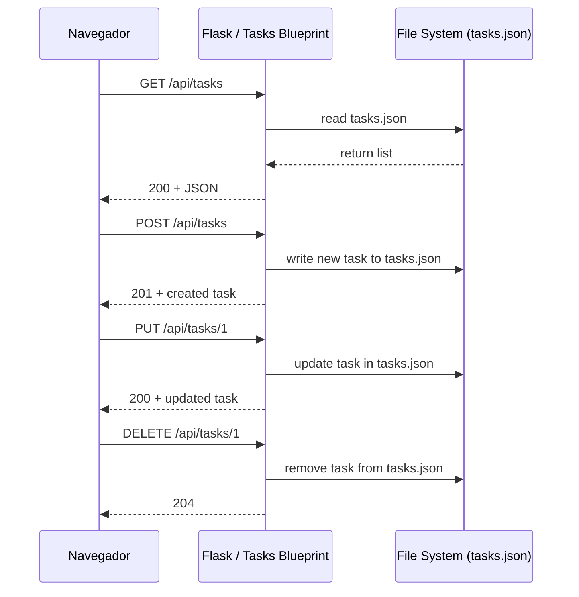

# Visión General del Proyecto

Este proyecto es una **aplicación Kanban mini‑Trello** que combina un backend sencillo en Flask con una interfaz de usuario SPA (Single Page Application) servida directamente desde el mismo servidor.  
El objetivo principal es permitir crear, leer, actualizar y eliminar tareas distribuidas en tres columnas: *Por Hacer*, *En Progreso* y *Hecho*. La persistencia se realiza mediante un archivo JSON (`tasks.json`) ubicado junto al módulo de rutas.

## Arquitectura Simplificada

1. **Backend (Flask)**  
   - Expose una API REST bajo el prefijo `/api`.  
   - Utiliza un blueprint llamado `tasks_bp` que gestiona todas las operaciones CRUD sobre tareas.  
   - Cada petición carga los datos desde `tasks.json`, realiza la operación y vuelve a guardarlos, garantizando consistencia en entornos de desarrollo sin concurrencia.

2. **Frontend (HTML + JavaScript)**  
   - Un único archivo `index.html` que incluye Bootstrap 5 para estilos y un script embebido que consume la API.  
   - Maneja el drag‑and‑drop entre columnas, edición inline y eliminación de tareas mediante llamadas AJAX a los endpoints.

3. **Persistencia**  
   - Archivo JSON (`tasks.json`) con una lista de objetos `{id, content, state}`.  
   - La lógica de generación de `id` garantiza que siempre sea el mayor existente +1.

---

# Arquitectura del Sistema

## Estructura de Paquetes



- `app.py`: Punto de entrada que crea y ejecuta la aplicación Flask.  
- `backend/`: Paquete con lógica de negocio y configuración de la app.  
- `frontend/`: Carpeta estática servida por Flask, contiene la SPA.  
- `tests/`: Testes de integración usando pytest.

## Flujo de Datos

1. **Solicitud HTTP** → 2. **Flask App** (carga blueprint) → 3. **Blueprint `tasks_bp`** → 4. **Funciones CRUD** (`_load_tasks`, `_save_tasks`) → 5. **Archivo JSON** ↔ 6. **Respuesta HTTP**.

---

# Endpoints de la API

| Método | Ruta | Parámetros | Cuerpo (JSON) | Respuesta | Código |
|--------|------|------------|---------------|-----------|--------|
| `GET` | `/api/tasks` | Ninguno | - | Lista de tareas | 200 |
| `POST` | `/api/tasks` | Ninguno | `{ "content": "<string>", "state": "<string>" }` | Tarea creada | 201 |
| `PUT` | `/api/tasks/<int:task_id>` | `task_id` | `{ "content"?: "<string>", "state"?: "<string>" }` | Tarea actualizada | 200 |
| `DELETE` | `/api/tasks/<int:task_id>` | `task_id` | - | - | 204 |

## Detalle de Respuestas

- **Tarea**  
  ```json
  {
    "id": 1,
    "content": "Ejemplo",
    "state": "Por Hacer"
  }
  ```

- **Errores comunes**  
  - `400 Bad Request`: Falta contenido o datos inválidos.  
  - `404 Not Found`: Tarea con el ID solicitado no existe.

## Diagramas de Secuencia



---

# Instrucciones de Instalación y Ejecución

```bash
# 1. Clonar el repositorio (o copiar los archivos)
git clone https://github.com/tu-usuario/kanban-mini-trello.git
cd kanban-mini-trello

# 2. Crear un entorno virtual (opcional pero recomendado)
python -m venv .venv
source .venv/bin/activate   # Windows: .\.venv\Scripts\activate

# 3. Instalar dependencias
pip install -r requirements.txt

# 4. Ejecutar la aplicación en modo desarrollo
python app.py
```

- La aplicación estará disponible en `http://127.0.0.1:5000/`.
- Los tests pueden ejecutarse con:

```bash
pytest tests/test_backend.py
```

---

# Flujo de Datos Clave

```mermaid
flowchart TD
    A[Cliente] -->|GET /api/tasks| B(Flask App)
    B --> C{Blueprint tasks_bp}
    C --> D[_load_tasks()]
    D --> E[Read tasks.json]
    E --> F[Return list]
    F --> B
    B --> G[Send JSON 200]

    A -->|POST /api/tasks| H
    H --> I[_save_tasks(newTask)]
    I --> J[Write to tasks.json]
    J --> K[Return created task]
```

- **Carga**: Cada endpoint lee el archivo completo al inicio de la petición.  
- **Persistencia**: Se sobrescribe el archivo tras cada operación que modifica datos.  
- **Concurrente**: No se maneja bloqueo; es adecuado solo para desarrollo o uso con una sola instancia.

---

# Extensiones Futuras (Opcional)

1. **Base de Datos Relacional**  
   - Migrar `tasks.json` a SQLite/PostgreSQL usando SQLAlchemy.  
   - Añadir migraciones y soporte multi‑usuario.

2. **Autenticación y Autorización**  
   - JWT o sesiones para proteger los endpoints.  
   - Roles (admin, usuario) con permisos diferenciados.

3. **WebSocket / SSE**  
   - Notificaciones en tiempo real cuando se añaden/actualizan/eliminan tareas.

4. **Persistencia de Estado de Drag‑and‑Drop**  
   - Almacenar la posición exacta de cada tarjeta para recrear el tablero tal como lo dejó el usuario.

5. **Pruebas Unitarias del Frontend**  
   - Utilizar Jest/Testing Library para asegurar que los componentes DOM reaccionan correctamente a las llamadas API.