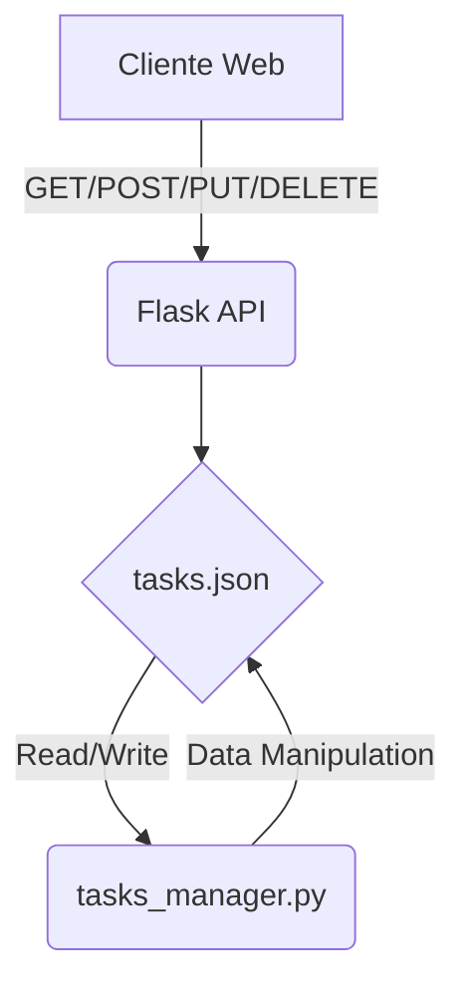

Need produce markdown doc.# Documentación Técnica del Proyecto Kanban Mini-Trello

## Visión General del Proyecto
Kanban Mini‑Trello es una aplicación web ligera que permite gestionar tareas en un tablero Kanban con tres columnas: **Por Hacer**, **En Progreso** y **Hecho**. El front‑end está construido con HTML, CSS y JavaScript puro (sin frameworks) y consume una API REST desarrollada con Flask. Los datos persisten en un archivo JSON (`tasks.json`) mediante el módulo `tasks_manager`. La aplicación soporta operaciones CRUD básicas: listar, crear, actualizar y eliminar tareas.

## Arquitectura del Sistema
```
┌───────────────────────┐
│  Navegador Web        │
│  (static/index.html)  │
└─────────────▲─────────┘
              │ HTTP/JSON
┌─────────────▼─────────┐
│   Flask API           │
│  - Endpoints /api/tasks            │
│  - CORS habilitado                    │
└─────────────▲─────────┘
              │ File I/O
┌─────────────▼─────────┐
│ tasks_manager.py      │
│  • load_tasks          │
│  • save_tasks          │
│  • generate_task_id    │
│  • find_task_by_id     │
│  • delete_task_by_id   │
└───────────────────────┘
```


## Endpoints de la API

| Método | Ruta | Descripción |
|--------|------|-------------|
| `GET`  | `/api/tasks` | Devuelve todas las tareas en formato JSON. |
| `POST` | `/api/tasks` | Crea una nueva tarea con `content` y opcionalmente `state`. El estado se valida contra los valores permitidos (`Por Hacer`, `En Progreso`, `Hecho`). |
| `PUT`  | `/api/tasks/<int:task_id>` | Actualiza el contenido y/o estado de la tarea identificada por `task_id`. |
| `DELETE` | `/api/tasks/<int:task_id>` | Elimina la tarea con el ID especificado. |

### Ejemplo de Respuesta
```json
{
  "tasks": [
    {"id": 1, "content": "Tarea ejemplo", "state": "Por Hacer"},
    ...
  ]
}
```

## Instrucciones de Instalación y Ejecución

1. **Clonar el repositorio**  
   ```bash
   git clone <url-del-repositorio>
   cd kanban-mini-trello
   ```

2. **Crear un entorno virtual (opcional pero recomendado)**  
   ```bash
   python -m venv .venv
   source .venv/bin/activate  # Windows: .venv\Scripts\activate
   ```

3. **Instalar dependencias**  
   ```bash
   pip install -r requirements.txt
   ```

4. **Inicializar el archivo de datos**  
   La aplicación lo hace automáticamente al arrancar, pero puede crearse manualmente:  
   ```bash
   echo "[]" > tasks.json
   ```

5. **Ejecutar la aplicación**  
   ```bash
   python backend.py
   ```
   El servidor escuchará en `http://0.0.0.0:5000`. Accede a la URL desde tu navegador para ver el tablero.

6. **Pruebas unitarias**  
   ```bash
   pytest tests/test_backend.py
   ```

## Flujo de Datos Clave

1. **Usuario crea una tarea**  
   - El usuario escribe en el campo `#new-task-input` y pulsa el botón “Añadir”.
   - JavaScript ejecuta la función `addTask(content)`, que envía un `POST /api/tasks` con JSON `{content, state: "Por Hacer"}`.
   - Flask recibe la petición, valida los datos, genera un ID único (`generate_task_id`) y guarda el nuevo objeto en `tasks.json`.
   - La API responde con el objeto creado. El front‑end añade una tarjeta (`div.card`) al contenedor “Por Hacer”.

2. **Usuario mueve una tarea entre columnas**  
   - Al soltar la tarjeta sobre otra columna, se dispara un evento `drop`. Se extrae el ID de la tarea y el nuevo estado.
   - Se envía un `PUT /api/tasks/<id>` con `{state: <nuevo_estado>}`.
   - Flask actualiza el objeto en memoria y persiste los cambios. La tarjeta se mueve en el DOM para reflejar el cambio.

3. **Usuario edita el contenido**  
   - Doble clic sobre la tarjeta activa `editCard`, reemplazando la tarjeta por un `<input>` pre‑llenado.
   - Al perder foco o pulsar Enter, se envía un `PUT /api/tasks/<id>` con `{content: <nuevo_contenido>}`.
   - Flask actualiza el archivo y devuelve éxito; el front‑end vuelve a renderizar la tarjeta con el nuevo texto.

4. **Usuario elimina una tarea**  
   - (No implementado en la UI, pero disponible vía API) Se envía un `DELETE /api/tasks/<id>` desde cualquier cliente.
   - Flask elimina la entrada del archivo y devuelve `{message: "Task deleted successfully."}`.

Este flujo demuestra cómo la capa de presentación interactúa con la API y cómo los cambios se persisten en el almacenamiento de archivos, manteniendo la aplicación ligera y fácil de desplegar.