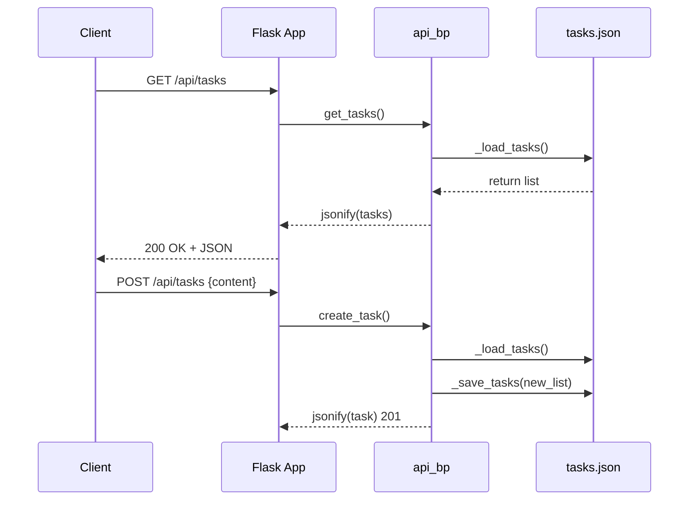

# Visión General del Proyecto

Este proyecto es una **API RESTful simple** construida con Flask que gestiona tareas (tasks) almacenadas en un archivo JSON local (`tasks.json`). La API permite crear, leer, actualizar y eliminar tareas a través de endpoints HTTP estándar. Además, sirve una aplicación frontend estática desde la carpeta `frontend`, lo que facilita el acceso directo al cliente web sin necesidad de configuración adicional.

El flujo típico para un usuario es:

1. **Crear** una tarea enviando un JSON con el campo `"content"`.
2. **Listar** todas las tareas mediante una solicitud GET.
3. **Actualizar** la información o estado de una tarea específica usando PUT.
4. **Eliminar** una tarea por su identificador.

El proyecto está pensado para prototipos, pruebas rápidas y demostraciones; no incluye autenticación ni persistencia en base de datos, lo que lo hace ligero y fácil de desplegar localmente.

---

# Arquitectura del Sistema

## Componentes Principales
| Componente | Descripción |
|------------|-------------|
| **Flask App** | Punto de entrada de la aplicación. Configura el servidor web y registra blueprints. |
| **Blueprint `api_bp`** | Agrupa los endpoints REST bajo `/api`. Se encuentra en `routes.py`. |
| **Persistencia JSON** | Los datos se guardan en un archivo `tasks.json` ubicado en el directorio raíz del proyecto. |
| **Frontend estático** | Carpeta `frontend` sirve como recurso de archivos HTML/CSS/JS a través de Flask. |

## Flujo de Solicitud



---

# Endpoints de la API

| Método | Ruta | Parámetros | Cuerpo | Respuesta | Código |
|--------|------|------------|--------|-----------|--------|
| **GET** | `/api/tasks` | - | - | Lista de tareas (`[{id, content, state}]`) | 200 |
| **POST** | `/api/tasks` | - | `{ "content": "<texto>" }` | Tarea creada | 201 |
| **PUT** | `/api/tasks/<int:task_id>` | `task_id` | Opcional: `{ "content": "...", "state": "..." }` | Tarea actualizada | 200 |
| **DELETE** | `/api/tasks/<int:task_id>` | `task_id` | - | Mensaje de éxito | 200 |

## Detalle de Campos

- **id** (`int`) – Identificador único autoincremental.
- **content** (`string`) – Descripción textual de la tarea.
- **state** (`string`) – Estado actual. Valores por defecto: `"Por Hacer"`; puede ser cualquier cadena.

---

# Instrucciones de Instalación y Ejecución

1. **Clonar el repositorio**  
   ```bash
   git clone https://github.com/tu_usuario/tu_repositorio.git
   cd tu_repositorio
   ```

2. **Crear un entorno virtual (opcional pero recomendado)**  
   ```bash
   python3 -m venv .venv
   source .venv/bin/activate  # En Windows: .venv\Scripts\activate
   ```

3. **Instalar dependencias**  
   ```bash
   pip install Flask
   ```

4. **Ejecutar la aplicación**  
   ```bash
   export FLASK_APP=app/__init__.py  # Ajusta según estructura real
   flask run --host=0.0.0.0 --port=5000
   ```
   La API estará disponible en `http://localhost:5000/api/tasks`.

5. **Acceder al frontend**  
   Navega a `http://localhost:5000/` para cargar la interfaz estática.

---

# Flujo de Datos Clave

```mermaid
flowchart TD
    A[Cliente] -->|GET /api/tasks| B{Flask App}
    B --> C[api_bp.get_tasks]
    C --> D[_load_tasks() → tasks.json]
    D --> E[Lista de tareas JSON]
    E --> F[Respuesta 200 OK]

    G[Cliente] -->|POST /api/tasks| H{Flask App}
    H --> I[api_bp.create_task]
    I --> J[_load_tasks()]
    J --> K[Generar new_id]
    K --> L[Crear objeto task]
    L --> M[Append a lista]
    M --> N[_save_tasks() → tasks.json]
    N --> O[Respuesta 201 Created]

    P[Cliente] -->|PUT /api/tasks/3| Q{Flask App}
    Q --> R[api_bp.update_task]
    R --> S[_load_tasks()]
    S --> T[Buscar task con id=3]
    T --> U[Actualizar campos]
    U --> V[_save_tasks()]
    V --> W[Respuesta 200 OK]

    X[Cliente] -->|DELETE /api/tasks/3| Y{Flask App}
    Y --> Z[api_bp.delete_task]
    Z --> AA[_load_tasks()]
    AA --> AB[Filtro por id]
    AB --> AC[_save_tasks()]
    AC --> AD[Respuesta 200 OK]
```

---

# Extensiones Futuras (Opcional)

- **Persistencia en Base de Datos**  
  Migrar el almacenamiento JSON a SQLite/PostgreSQL usando SQLAlchemy para escalabilidad y concurrencia.

- **Autenticación JWT**  
  Añadir autenticación por token para proteger los endpoints, especialmente `POST`, `PUT` y `DELETE`.

- **Validaciones Avanzadas**  
  Usar Marshmallow o Pydantic para validar y serializar los modelos de tarea, garantizando tipos y formatos.

- **Paginación y Filtros**  
  Implementar parámetros `page`, `limit`, `state` en el endpoint GET para manejar grandes volúmenes de tareas.

- **WebSocket o Server-Sent Events**  
  Notificar al frontend sobre cambios en tiempo real cuando se creen, actualicen o eliminen tareas.