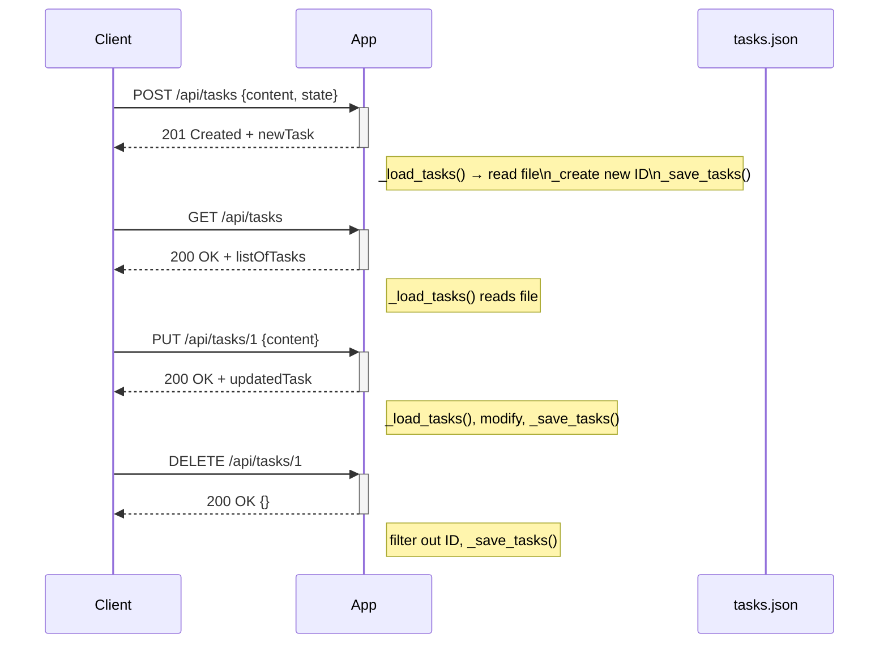

# Visión General del Proyecto

Este proyecto es una API RESTful sencilla construida con **Flask** que permite gestionar tareas (tasks). La lógica de negocio se centra en CRUD básico sobre un conjunto de tareas almacenadas en un archivo JSON (`tasks.json`) ubicado a nivel raíz del proyecto. No hay base de datos relacional ni ORM; la persistencia se maneja directamente mediante lectura/escritura de archivos.

El flujo típico es:

1. **Creación**: Se envía una petición `POST /api/tasks` con el contenido y opcionalmente el estado (`state`). El servidor asigna un ID único, guarda la tarea en el JSON y devuelve la nueva entidad.
2. **Lectura**: `GET /api/tasks` devuelve todas las tareas actuales; no hay paginación ni filtros.
3. **Actualización**: `PUT /api/tasks/<id>` permite modificar el contenido o estado de una tarea existente.
4. **Eliminación**: `DELETE /api/tasks/<id>` elimina la tarea correspondiente.

La aplicación se expone a través de un único blueprint (`tasks_bp`) y sirve también los archivos estáticos del frontend (carpeta `frontend`), aunque el código del frontend no forma parte del volcado proporcionado.

---

# Arquitectura del Sistema

## Componentes Principales

| Componente | Responsabilidad |
|------------|-----------------|
| **Flask App** (`__init__.py`) | Inicializa la aplicación, configura rutas y sirve contenido estático. |
| **Blueprint `tasks_bp`** (`routes.py`) | Define los endpoints de la API y la lógica de negocio CRUD. |
| **Persistencia JSON** | Archivo `tasks.json` que almacena las tareas como una lista de objetos. |
| **Frontend** | Carpeta `frontend` (no incluida en el volcado) sirve la interfaz web estática. |

### Diagrama Mermaid

```mermaid
graph TD
    A[Flask App] --> B[Blueprint tasks_bp]
    B --> C{Endpoint}
    C --> D[GET /api/tasks]
    C --> E[POST /api/tasks]
    C --> F[PUT /api/tasks/<id>]
    C --> G[DELETE /api/tasks/<id>]
    B --> H[JSON File (tasks.json)]
    A --> I[Static Folder (frontend)]
```

---

# Endpoints de la API

| Método | Ruta | Parámetros | Cuerpo | Respuesta | Código |
|--------|------|------------|--------|-----------|--------|
| `GET` | `/api/tasks` | Ninguno | N/A | Lista JSON de tareas | 200 |
| `POST` | `/api/tasks` | `content`, opcional `state` (default `"Por Hacer"`) | `{"content":"...", "state":"..."}` | Tarea creada con ID | 201 |
| `PUT` | `/api/tasks/<int:task_id>` | `task_id` en la URL | `{"content":"...","state":"..."}` (uno o ambos) | Tarea actualizada | 200 |
| `DELETE` | `/api/tasks/<int:task_id>` | `task_id` en la URL | N/A | JSON vacío `{}` | 200 |

### Esquema de los Datos

```json
{
  "id": 1,
  "content": "Ejemplo de tarea",
  "state": "Por Hacer"
}
```

#### Validaciones

- `POST`: Si falta `content`, devuelve `400` con mensaje `"Content is required"`.
- `PUT/DELETE`: Si la tarea no existe, responde `404` con descripción `"Task not found"`.

---

# Instrucciones de Instalación y Ejecución

1. **Clonar el repositorio**  
   ```bash
   git clone https://github.com/tu_usuario/proyecto-tasks.git
   cd proyecto-tasks
   ```

2. **Crear entorno virtual (opcional pero recomendado)**  
   ```bash
   python3 -m venv .venv
   source .venv/bin/activate  # Windows: .venv\Scripts\activate
   ```

3. **Instalar dependencias**  
   ```bash
   pip install flask
   ```

4. **Crear archivo `tasks.json` (opcional)**  
   Si no existe, la API lo creará automáticamente al recibir la primera petición.

5. **Ejecutar la aplicación**  
   ```bash
   export FLASK_APP=app/__init__.py  # Linux/macOS
   set FLASK_APP=app\__init__.py     # Windows CMD
   flask run
   ```

6. **Acceder a la API**  
   - `GET http://127.0.0.1:5000/api/tasks`
   - `POST http://127.0.0.1:5000/api/tasks` con cuerpo JSON.

---

# Flujo de Datos Clave



---

# Extensiones Futuras (Opcional)

| Área | Posible Mejora |
|------|----------------|
| **Persistencia** | Migrar a una base de datos SQLite o PostgreSQL usando SQLAlchemy para escalabilidad y concurrencia. |
| **Validación** | Integrar `marshmallow` u otro esquema de validación para robustecer la entrada de datos. |
| **Autenticación** | Añadir JWT o OAuth2 para proteger los endpoints, especialmente en entornos productivos. |
| **Paginación/Filtrado** | Implementar parámetros query (`?page=1&size=20&state=Done`) para manejar grandes volúmenes de tareas. |
| **Testing** | Desarrollar pruebas unitarias y de integración con `pytest` y `Flask-Testing`. |
| **Dockerización** | Crear un Dockerfile y docker-compose para despliegue reproducible. |

---