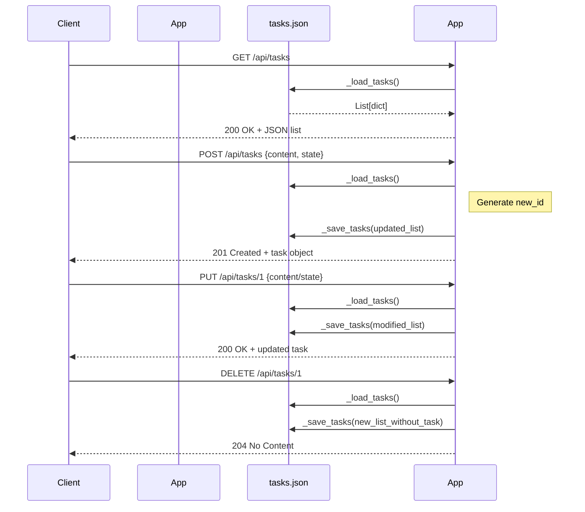

# Visión General del Proyecto

Este proyecto es una API RESTful sencilla construida con **Flask** que gestiona tareas (tasks).  
La lógica de negocio se centra en un archivo JSON (`tasks.json`) que actúa como base de datos ligera, cargado y guardado en memoria en cada petición. La aplicación expone los endpoints CRUD habituales (Create, Read, Update, Delete) a través de la ruta `/api/tasks`. Además, el mismo servidor sirve una SPA front‑end ubicada en `../frontend`.

## Características principales

| Feature | Descripción |
|---------|-------------|
| **Persistencia** | Datos almacenados en un único archivo JSON (`tasks.json`). No se requiere base de datos externa. |
| **Blueprints** | Todas las rutas relacionadas con tareas están agrupadas bajo el blueprint `tasks_bp`. |
| **Autogeneración de IDs** | Cada nueva tarea recibe un ID entero que es uno mayor al máximo existente (o 1 si no hay tareas). |
| **Validaciones simples** | Se valida la presencia y tipo de los campos `content` y `state` en las peticiones. |
| **Respuesta HTTP estándar** | Los endpoints devuelven códigos HTTP adecuados (`200`, `201`, `204`, `400`, `404`). |

---

# Arquitectura del Sistema

## Diagrama de componentes (Mermaid)

```mermaid
graph TD
    A[Flask App] --> B[Blueprint: tasks_bp]
    B --> C[Routes (/api/tasks)]
    C --> D[_load_tasks() / _save_tasks()]
    D --> E[tasks.json]
    A --> F[Static Folder: ../frontend]
```

- **Flask App**: Punto de entrada, crea la instancia `app`, registra el blueprint y sirve archivos estáticos.
- **Blueprint `tasks_bp`**: Encapsula todas las rutas relacionadas con tareas.
- **Funciones auxiliares `_load_tasks()` / `_save_tasks()`**: Manejan la lectura/escritura del archivo JSON.
- **Archivo `tasks.json`**: Almacena el estado de las tareas en formato JSON.

## Estructura de paquetes

```
backend/
├── __init__.py          # create_app factory
└── routes.py            # Blueprint y endpoints CRUD
frontend/                # SPA (no incluido en este dump)
```

---

# Endpoints de la API

| Método | Ruta | Parámetros | Cuerpo | Respuesta | Código HTTP |
|--------|------|------------|--------|-----------|-------------|
| **GET** | `/api/tasks` | - | - | Lista completa de tareas | 200 |
| **POST** | `/api/tasks` | - | `{"content":"texto","state":"Por Hacer"}` | Tarea creada | 201 |
| **PUT** | `/api/tasks/<int:task_id>` | `<int:task_id>` | `{"content":"nuevo texto","state":"En Progreso"}` (ambos opcionales) | Tarea actualizada | 200 |
| **DELETE** | `/api/tasks/<int:task_id>` | `<int:task_id>` | - | - | 204 |

### Ejemplo de respuesta

```json
{
  "id": 3,
  "content": "Revisar código",
  "state": "En Progreso"
}
```

---

# Instrucciones de Instalación y Ejecución

1. **Clonar el repositorio**  
   ```bash
   git clone https://github.com/usuario/proyecto-tasks.git
   cd proyecto-tasks/backend
   ```

2. **Crear entorno virtual (opcional pero recomendado)**  
   ```bash
   python3 -m venv .venv
   source .venv/bin/activate  # Windows: .venv\Scripts\activate
   ```

3. **Instalar dependencias**  
   ```bash
   pip install Flask
   ```

4. **Ejecutar la aplicación**  
   ```bash
   export FLASK_APP=__init__.py
   flask run --host 0.0.0.0 --port 5000
   ```
   La API estará disponible en `http://localhost:5000/api/tasks` y el front‑end en `http://localhost:5000/`.

5. **Probar endpoints** (ejemplo con `curl`)  
   ```bash
   curl -X POST http://localhost:5000/api/tasks \
        -H "Content-Type: application/json" \
        -d '{"content":"Ejemplo","state":"Por Hacer"}'
   ```

---

# Flujo de Datos Clave



---

# Extensiones Futuras (Opcional)

| Área | Posible mejora |
|------|----------------|
| **Persistencia** | Migrar a una base de datos relacional o NoSQL para escalabilidad y concurrencia. |
| **Autenticación** | Añadir JWT/Session para proteger los endpoints CRUD. |
| **Validaciones avanzadas** | Usar `marshmallow` o `pydantic` para schemas más robustos. |
| **Documentación automática** | Integrar Swagger/OpenAPI con Flask‑RESTX o FastAPI. |
| **Testing** | Añadir pruebas unitarias y de integración usando `pytest`. |

---