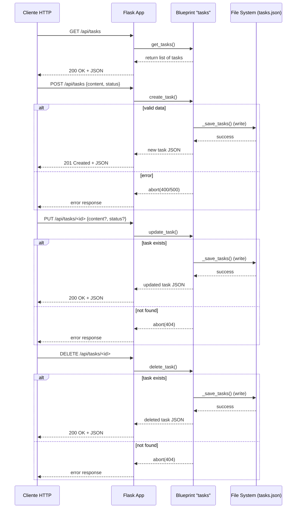

# Visión General del Proyecto

Este proyecto es un **backend sencillo de Kanban** construido con Flask. Su objetivo principal es gestionar tareas a través de una API RESTful, permitiendo crear, leer, actualizar y eliminar tareas (CRUD). El front‑end se sirve desde la carpeta `frontend` mediante el mecanismo de static files de Flask.

## Características principales
- **Persistencia en disco**: las tareas se guardan en un archivo JSON (`tasks.json`) dentro del paquete `backend`. Se utiliza una lógica de bloqueo global para evitar condiciones de carrera cuando múltiples hilos acceden al fichero.
- **Validación de datos**: cada tarea debe contener un campo `content` y un `status` que debe ser uno de los valores permitidos (`Por Hacer`, `En Progreso`, `Hecho`).
- **Endpoints REST** expuestos bajo el prefijo `/api`.  
  - `GET /tasks`: lista todas las tareas.  
  - `POST /tasks`: crea una nueva tarea.  
  - `PUT /tasks/<id>`: actualiza la tarea con el identificador dado.  
  - `DELETE /tasks/<id>`: elimina la tarea.
- **Seguridad mínima**: no hay autenticación ni autorización; cualquier cliente puede acceder a los endpoints.

## Flujo de ejecución
1. Al arrancar, Flask ejecuta la fábrica `create_app()`.
2. Se carga el archivo JSON y se guarda en `app.config['TASKS']`.
3. El blueprint `tasks_bp` se registra bajo `/api`, exponiendo los endpoints.
4. Cuando un cliente hace una petición, el handler correspondiente lee o modifica la lista en memoria y persiste los cambios llamando a `_save_tasks()`.

---

# Arquitectura del Sistema

## Diagrama de componentes
```mermaid
graph TD
    A[Cliente HTTP] -->|REST| B[Flask App]
    B --> C{Blueprint "tasks"}
    C --> D[GET /tasks]
    C --> E[POST /tasks]
    C --> F[PUT /tasks/<id>]
    C --> G[DELETE /tasks/<id>]
    B --> H[File System (tasks.json)]
```

## Tabla de módulos

| Módulo | Responsabilidad |
|--------|-----------------|
| `app.py` | Punto de entrada que crea la app y la ejecuta. |
| `__init__.py` | Fábrica de aplicación, carga tareas, registra blueprints y sirve el front‑end. |
| `routes.py` | Define el blueprint `tasks_bp` con los endpoints CRUD y lógica de validación. |
| `tasks.json` | Almacén persistente (JSON) para las tareas. |

---

# Endpoints de la API

## Tabla de rutas

| Método | Ruta | Parámetros | Cuerpo | Respuesta | Código HTTP |
|--------|------|------------|--------|-----------|-------------|
| GET | `/api/tasks` | - | - | Lista JSON de tareas | 200 |
| POST | `/api/tasks` | `content`, opcional `status` | `{ "content": "...", "status": "..." }` | Objeto tarea creado | 201 |
| PUT | `/api/tasks/<int:task_id>` | `task_id` en URL, `content` y/o `status` en cuerpo | `{ "content": "...", "status": "..." }` | Tarea actualizada | 200 |
| DELETE | `/api/tasks/<int:task_id>` | `task_id` en URL | - | Objeto tarea eliminada | 200 |

## Especificaciones de validación

- **Campo `content`**: obligatorio para POST, opcional pero no vacío para PUT.
- **Campo `status`**: debe ser uno de `['Por Hacer', 'En Progreso', 'Hecho']`. Si se omite en POST, el valor por defecto es `'Por Hacer'`.
- **Errores comunes**:
  - 400 Bad Request si falta `content` o `status` inválido.
  - 404 Not Found si la tarea no existe para PUT/DELETE.
  - 500 Internal Server Error si falla la escritura en disco.

---

# Instrucciones de Instalación y Ejecución

1. **Clonar el repositorio**  
   ```bash
   git clone https://github.com/tu-usuario/kanban-backend.git
   cd kanban-backend/backend
   ```

2. **Crear entorno virtual (opcional pero recomendado)**  
   ```bash
   python3 -m venv .venv
   source .venv/bin/activate  # En Windows: .venv\Scripts\activate
   ```

3. **Instalar dependencias**  
   ```bash
   pip install Flask
   ```

4. **Ejecutar la aplicación**  
   ```bash
   python app.py
   ```
   La API estará disponible en `http://0.0.0.0:5000/api/tasks` y el front‑end en `http://0.0.0.0:5000/`.

---

# Flujo de Datos Clave



---

# Extensiones Futuras (Opcional)

- **Persistencia en base de datos**: migrar de archivos JSON a SQLite o PostgreSQL usando SQLAlchemy para escalabilidad y concurrencia real.
- **Autenticación/Autorización**: JWT o OAuth2 para proteger los endpoints y asignar tareas a usuarios específicos.
- **WebSocket / SSE**: notificar al front‑end en tiempo real cuando se crean, actualizan o eliminan tareas.
- **Validaciones avanzadas**: usar `marshmallow` o `pydantic` para validar y serializar datos de forma más robusta.
- **Pruebas unitarias e integración**: añadir tests con `pytest` y cobertura de código.