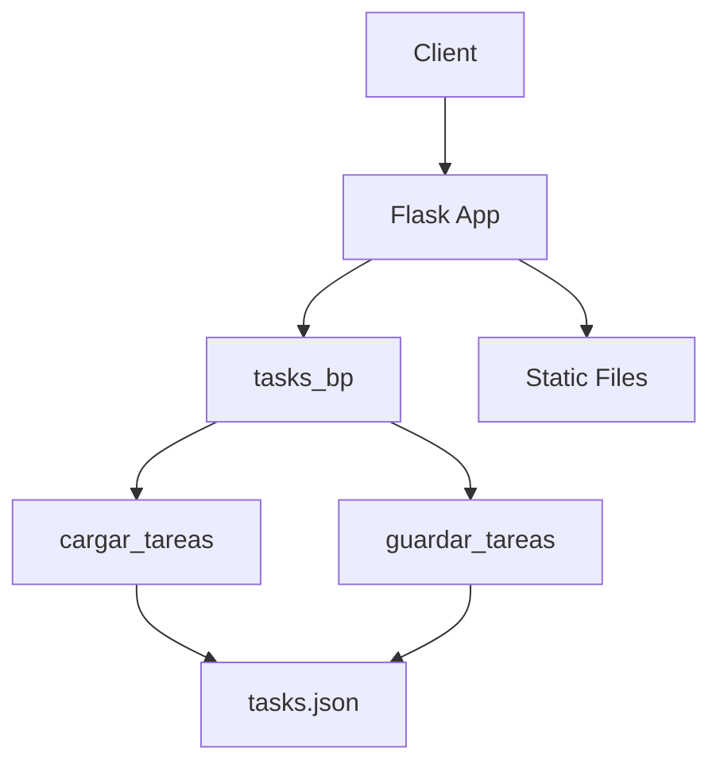
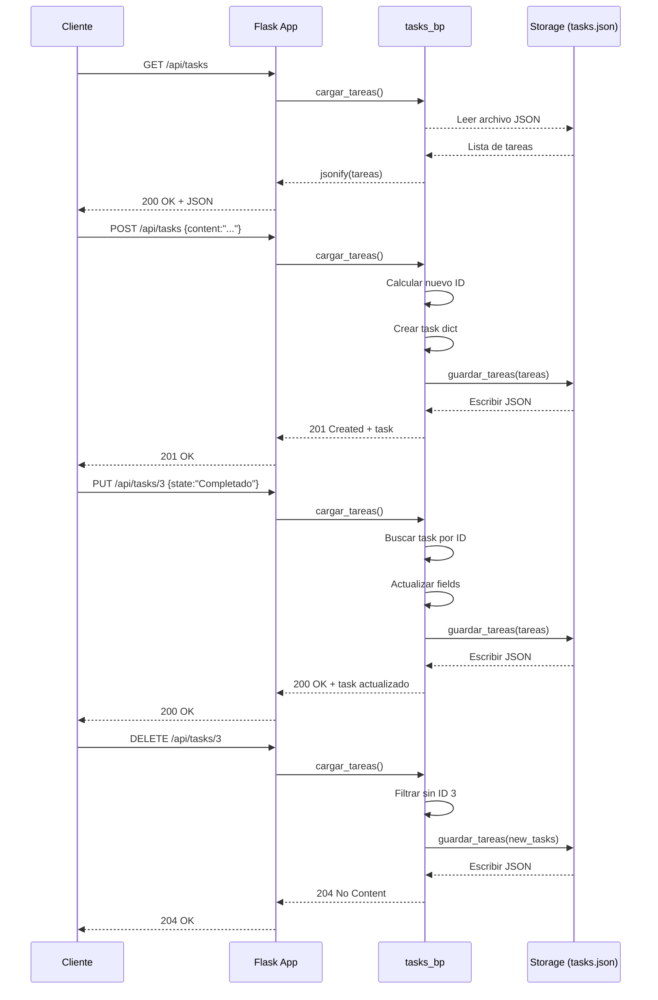

# Visión General del Proyecto
Este proyecto es una API RESTful simple construida con **Flask** que permite gestionar tareas (CRUD) y sirve una aplicación frontend estática desde la carpeta `frontend`.  
El flujo de trabajo es el siguiente:

1. El cliente realiza peticiones HTTP a los endpoints `/api/tasks` para crear, leer, actualizar o eliminar tareas.
2. Cada tarea se almacena en un archivo JSON (`tasks.json`) dentro del mismo paquete Python, lo que elimina la necesidad de una base de datos externa.
3. La aplicación también expone la raíz `/` que devuelve el `index.html` estático, ofreciendo así una interfaz web ligera.

El objetivo es proporcionar una API mínima pero funcional, ideal para prototipos o pequeños proyectos donde la persistencia simple sea suficiente.


# Arquitectura del Sistema
```
┌───────────────────────┐
│  Frontend (static)    │
│  └ index.html + JS     │
└────────────┬───────────┘
             │
             ▼
      Flask Application
┌───────────────────────┐
│   create_app()         │
│   - Registers /api/tasks Blueprint
│   - Serves static files
│   - Error handlers (400, 404)
└───────┬───────────────┘
        │
        ▼
  Routes Blueprint (tasks_bp)
┌───────────────────────────────┐
│   GET /api/tasks               │
│   POST /api/tasks              │
│   PUT /api/tasks/<int:id>      │
│   DELETE /api/tasks/<int:id>   │
└───────┬───────────────────────┘
        │
        ▼
  tasks_storage module
┌───────────────────────────────┐
│   cargar_tareas()              │
│   guardar_tareas(tareas)       │
└───────────────────────────────┘
```

## Componentes Clave

| Componente | Responsabilidad |
|------------|-----------------|
| `create_app()` | Configura la aplicación Flask, registra blueprints y maneja rutas estáticas. |
| `tasks_bp` | Define los endpoints REST para tareas. |
| `cargar_tareas()` | Lee el archivo `tasks.json`, devuelve una lista de dicts o `[]`. |
| `guardar_tareas(tareas)` | Serializa la lista de tareas a JSON con indentación 2. |

## Diagrama Mermaid


---

# Endpoints de la API
| Método | Ruta | Descripción | Parámetros | Respuesta |
|--------|------|-------------|------------|-----------|
| `GET` | `/api/tasks` | Obtiene todas las tareas. | Ninguno | `200 OK`, JSON array de tareas. |
| `POST` | `/api/tasks` | Crea una nueva tarea con estado por defecto **"Por Hacer"**. | `content` (string) | `201 Created`, objeto de la tarea creada. |
| `PUT` | `/api/tasks/<int:id>` | Actualiza el contenido o estado de una tarea existente. | `content` (opcional), `state` (opcional) | `200 OK`, objeto actualizado. |
| `DELETE` | `/api/tasks/<int:id>` | Elimina la tarea con el ID especificado. | Ninguno | `204 No Content`. |

### Ejemplo de Payload
```json
{
  "content": "Comprar leche",
  "state": "En Progreso"
}
```

---

# Instrucciones de Instalación y Ejecución
1. **Clonar el repositorio**  
   ```bash
   git clone https://github.com/tu_usuario/proyecto-tareas.git
   cd proyecto-tareas
   ```

2. **Crear un entorno virtual (opcional pero recomendado)**  
   ```bash
   python -m venv venv
   source venv/bin/activate  # Windows: venv\Scripts\activate
   ```

3. **Instalar dependencias**  
   ```bash
   pip install -r requirements.txt
   ```

4. **Ejecutar la aplicación en modo desarrollo**  
   ```bash
   export FLASK_APP=app.py      # o set FLASK_APP=app.py en Windows
   flask run
   ```
   La API estará disponible en `http://127.0.0.1:5000/api/tasks` y el frontend en `http://127.0.0.1:5000/`.

5. **(Opcional) Ejecutar pruebas**  
   ```bash
   pytest
   ```

---

# Flujo de Datos Clave


---

# Extensiones Futuras (Opcional)

1. **Persistencia en Base de Datos**  
   Sustituir `tasks.json` por una base de datos SQLite/PostgreSQL usando SQLAlchemy para escalabilidad y concurrencia.

2. **Autenticación y Autorización**  
   Añadir JWT o OAuth2 para proteger los endpoints, permitiendo que cada usuario tenga su propio conjunto de tareas.

3. **Filtrado & Paginación**  
   Implementar query params (`?state=Por+Hacer&page=2&size=10`) para mejorar la experiencia del cliente y reducir carga en el servidor.

4. **Pruebas Unitarias y de Integración**  
   Ampliar el conjunto de pruebas con `pytest` y cobertura de código, incluyendo casos de error (JSON inválido, ID inexistente).

5. **Dockerización**  
   Crear un `Dockerfile` y `docker-compose.yml` para facilitar despliegues en producción o entornos CI/CD.

---