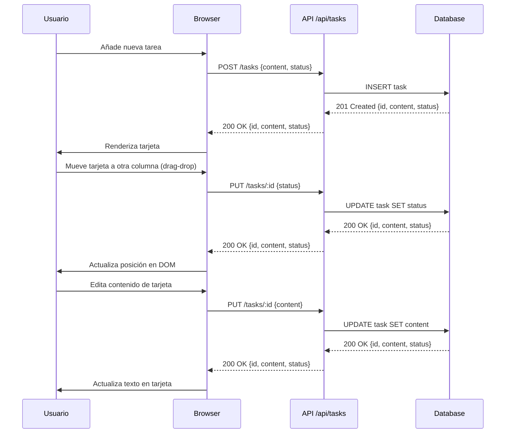

# Kanban Mini‑Trello

---

## Visión General del Proyecto

Kanban Mini‑Trello es una aplicación web ligera que permite gestionar tareas mediante el método Kanban clásico. La interfaz está compuesta por tres columnas: **Por Hacer**, **En Progreso** y **Hecho**. Los usuarios pueden crear nuevas tareas, editarlas en línea y moverlas entre columnas mediante arrastrar‑soltar. Toda la lógica de negocio se comunica con una API REST simple que expone los recursos de tarea (`/api/tasks`).

El proyecto está pensado para ser desplegado como un bundle estático: el `index.html`, CSS y JavaScript puro son suficientes para consumir la API, por lo que puede alojarse en cualquier servidor web o servicio de hosting estático.

---

## Arquitectura del Sistema

La arquitectura se basa en una separación clara entre **frontend** (responsable de la UI) y **backend** (gestión de datos). A continuación se muestra un diagrama Mermaid con los componentes principales:

```mermaid
graph TD
    subgraph Frontend
        A[Browser] -->|HTTP GET/POST/PUT| B[API /api/tasks]
        B --> C{Task Store}
        C -->|CRUD| D[Database (SQL/NoSQL)]
    end

    style Frontend fill:#f9f,stroke:#333,stroke-width:2px
```

### Descripción de componentes

| Componente | Responsabilidad |
|------------|-----------------|
| **Browser** | Renderiza el tablero Kanban y gestiona eventos de usuario (drag‑drop, edición). Utiliza fetch API para comunicarse con el backend. |
| **API `/api/tasks`** | Expose CRUD endpoints: `GET /tasks`, `POST /tasks`, `PUT /tasks/:id`. Se encarga de validar datos, persistir cambios y devolver respuestas JSON. |
| **Task Store** | Representa la capa intermedia que transforma las peticiones HTTP en operaciones sobre el modelo de tarea. |
| **Database** | Persistencia de tareas (puede ser SQLite, PostgreSQL, MongoDB, etc.). Cada registro contiene `id`, `content` y `status`. |

---

## Endpoints de la API

La API sigue un estilo RESTful con los siguientes endpoints:

| Método | Ruta | Parámetros | Descripción |
|--------|------|------------|-------------|
| **GET** | `/api/tasks` | - | Devuelve una lista JSON con todas las tareas. |
| **POST** | `/api/tasks` | `content`, `status` (opcional) | Crea una nueva tarea. Si no se especifica `status`, se asigna por defecto a *Por Hacer*. |
| **PUT** | `/api/tasks/:id` | `content` y/o `status` | Actualiza la tarea identificada por `id`. Se permite modificar el contenido, el estado o ambos. |

Ejemplo de respuesta JSON:

```json
{
  "id": "a1b2c3",
  "content": "Revisar pull request",
  "status": "En Progreso"
}
```

---

## Instrucciones de Instalación y Ejecución

> **Nota:** Este proyecto requiere un servidor que exponga la API `/api/tasks`. La guía a continuación asume que ya tienes una implementación backend (por ejemplo, Node.js + Express) corriendo en `http://localhost:3000`.

1. **Clonar el repositorio**

   ```bash
   git clone https://github.com/tuusuario/kanban-mini-trello.git
   cd kanban-mini-trello
   ```

2. **Instalar dependencias del backend (si aplica)**

   ```bash
   npm install          # o yarn install
   ```

3. **Configurar variables de entorno**

   - `API_URL` debe apuntar al host donde corre la API.  
     En el código fuente se usa `/api/tasks`, por lo que si tu servidor está en `http://localhost:3000`, no necesitas cambiar nada.

4. **Construir y servir el frontend**

   ```bash
   npm run build        # genera los archivos estáticos en /dist (si usas un bundler)
   npx serve dist       # sirve la carpeta dist localmente
   ```

5. **Acceder a la aplicación**

   Abre tu navegador y visita `http://localhost:5000` (o el puerto que hayas configurado).

---

## Flujo de Datos Clave



- **Carga inicial**: `GET /tasks` devuelve todas las tareas; el frontend las renderiza según su estado.
- **Creación**: `POST /tasks` crea la tarea y devuelve el objeto completo para insertarlo inmediatamente en el DOM.
- **Actualización** (estado o contenido): `PUT /tasks/:id` actualiza la base de datos y devuelve el recurso actualizado, lo que permite sincronizar la UI sin recargar.

---

## Extensiones Futuras

| Área | Posible mejora |
|------|----------------|
| **Autenticación** | Añadir JWT o OAuth para proteger los endpoints; permitir usuarios con sus propios tableros. |
| **Persistencia en tiempo real** | Integrar WebSocket (socket.io) para que los cambios se reflejen instantáneamente entre clientes conectados. |
| **Etiquetas y prioridades** | Extender el modelo de tarea añadiendo campos `label`, `priority`; actualizar la UI con badges o colores. |
| **Export/Import** | Permitir exportar e importar tableros en formato JSON para respaldo o migración. |
| **Responsive avanzado** | Mejorar la experiencia móvil usando CSS Grid y touch‑drag‑drop nativo. |

---