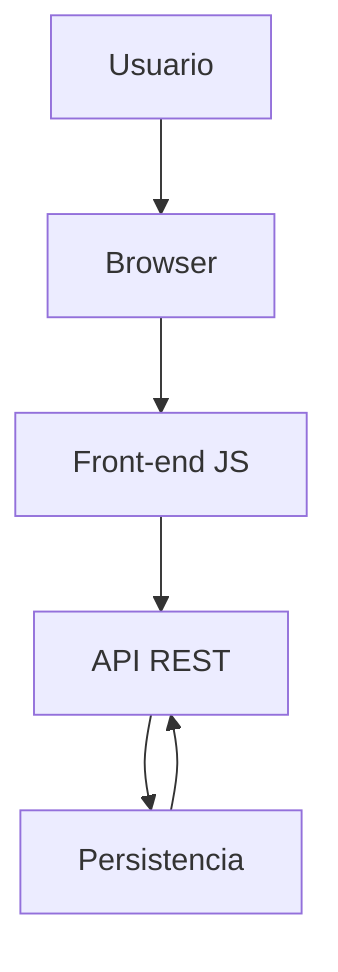
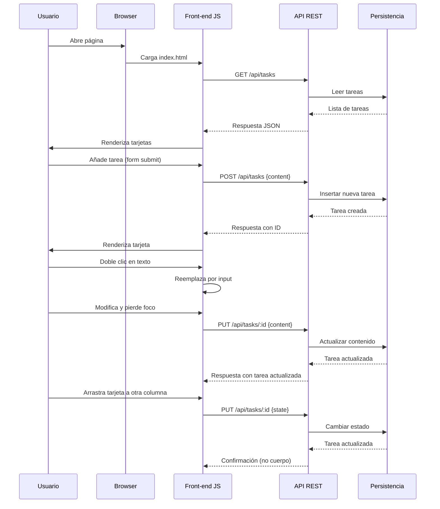

# Visión General del Proyecto

Kanban Mini‑Trello es una aplicación web sencilla que permite gestionar tareas en un tablero Kanban con tres columnas: **Por Hacer**, **En Progreso** y **Hecho**. La interfaz está construida con HTML, CSS (Bootstrap 5) y JavaScript puro, y se comunica con una API RESTful que expone los endpoints necesarios para crear, leer, actualizar y eliminar tareas.

El flujo de trabajo típico es el siguiente:

1. Al cargar la página, el cliente hace un `GET /api/tasks` para obtener todas las tareas existentes y las renderiza en sus columnas correspondientes.
2. El usuario puede añadir una nueva tarea mediante el formulario superior; se envía un `POST /api/tasks` con el contenido de la tarea.
3. Cada tarjeta es editable: al hacer doble clic sobre el texto, el cliente reemplaza el párrafo por un input y, cuando pierde foco o pulsa Enter, envía un `PUT /api/tasks/:id` para actualizar el contenido.
4. Las tarjetas pueden eliminarse haciendo clic en el botón rojo; se dispara un `DELETE /api/tasks/:id`.
5. El drag‑and‑drop permite mover una tarjeta entre columnas. Cuando se suelta sobre otra columna, se envía un `PUT /api/tasks/:id` con el nuevo estado.

El proyecto está pensado para ser desplegado como una aplicación de página única (SPA) acompañada por un pequeño backend que persista las tareas en memoria o en una base de datos simple.

---

# Arquitectura del Sistema

## Componentes Principales

| Componente | Descripción |
|------------|-------------|
| **Front‑end** | HTML/CSS/JS que renderiza el tablero Kanban y gestiona la interacción con el usuario. |
| **API REST** | Servicio HTTP que expone CRUD para tareas (`GET`, `POST`, `PUT`, `DELETE`). |
| **Persistencia** | Almacenamiento de tareas (in‑memory, SQLite, PostgreSQL, etc.). |

## Diagrama Mermaid



---

# Endpoints de la API

| Método | Ruta | Parámetros | Descripción | Respuesta |
|--------|------|------------|-------------|-----------|
| `GET`  | `/api/tasks` | ninguno | Obtiene todas las tareas. | `200 OK` <br>```json[{"id":"1","content":"Ejemplo","state":"Por Hacer"}]``` |
| `POST` | `/api/tasks` | `{ content: string }` | Crea una nueva tarea con estado **Por Hacer** por defecto. | `201 Created` <br>```json{ "id":"2", "content":"Nueva", "state":"Por Hacer" }``` |
| `PUT`  | `/api/tasks/:id` | `{ content?: string, state?: string }` | Actualiza el contenido o estado de la tarea identificada. | `200 OK` <br>```json{ "id":"2", "content":"Actualizado", "state":"En Progreso" }``` |
| `DELETE` | `/api/tasks/:id` | ninguno | Elimina la tarea especificada. | `204 No Content` |

## Ejemplo de Código del Backend (Express)

```js
const express = require('express');
const app = express();
app.use(express.json());

let tasks = [];
let nextId = 1;

app.get('/api/tasks', (_, res) => res.json(tasks));

app.post('/api/tasks', (req, res) => {
  const { content } = req.body;
  const task = { id: String(nextId++), content, state: 'Por Hacer' };
  tasks.push(task);
  res.status(201).json(task);
});

app.put('/api/tasks/:id', (req, res) => {
  const { id } = req.params;
  const task = tasks.find(t => t.id === id);
  if (!task) return res.sendStatus(404);
  Object.assign(task, req.body);
  res.json(task);
});

app.delete('/api/tasks/:id', (req, res) => {
  const { id } = req.params;
  tasks = tasks.filter(t => t.id !== id);
  res.sendStatus(204);
});

app.listen(3000, () => console.log('API listening on :3000'));
```

---

# Instrucciones de Instalación y Ejecución

1. **Clonar el repositorio**  
   ```bash
   git clone https://github.com/tu-usuario/kanban-mini-trello.git
   cd kanban-mini-trello
   ```

2. **Instalar dependencias del backend (Node.js)**  
   ```bash
   npm install express
   ```

3. **Ejecutar el servidor**  
   ```bash
   node server.js
   ```
   El API estará disponible en `http://localhost:3000`.

4. **Servir la interfaz estática**  
   Puedes abrir directamente `index.html` en un navegador o servirla con cualquier servidor HTTP (por ejemplo, `npx http-server`). Si usas el mismo proceso de Node, copia `index.html` en una carpeta `public/` y añade:
   ```js
   app.use(express.static('public'));
   ```

5. **Acceder a la aplicación**  
   Navega a `http://localhost:3000/index.html`.

---

# Flujo de Datos Clave



---

# Extensiones Futuras

| Área | Posible Mejora |
|------|----------------|
| **Persistencia** | Migrar de memoria a una base de datos relacional o NoSQL para persistir tareas entre reinicios. |
| **Autenticación** | Añadir login y roles (administrador, colaborador) con JWT. |
| **Colaboración en tiempo real** | Integrar WebSocket (socket.io) para actualizar el tablero en todos los clientes simultáneamente. |
| **Etiquetas y prioridades** | Extender la entidad `Task` con campos `label`, `priority`. |
| **Export/Import** | Permitir exportar e importar tareas en formato JSON o CSV. |
| **Tests** | Añadir pruebas unitarias (Jest) para el backend y pruebas de integración end‑to‑end (Cypress). |

---