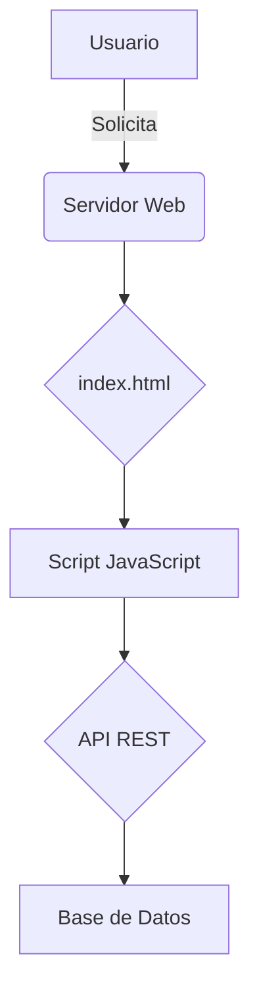
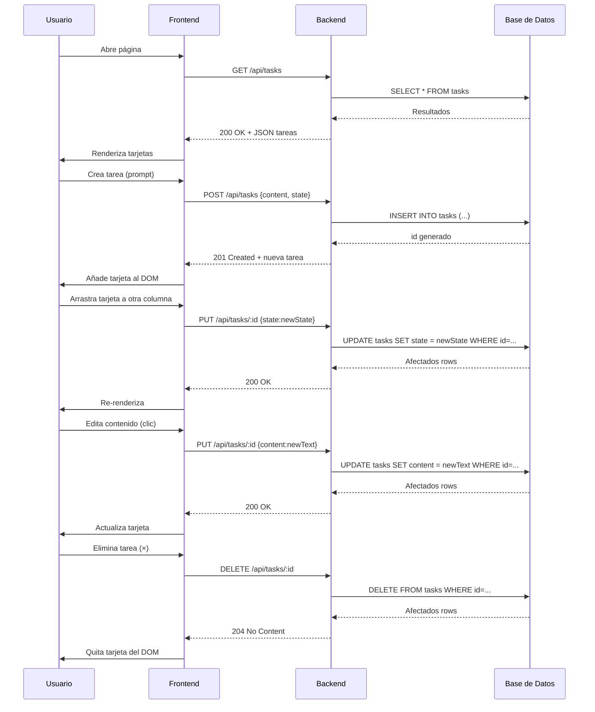

# Visión General del Proyecto

Kanban Mini‑Trello es una aplicación web ligera que permite gestionar tareas en un tablero Kanban con tres columnas: **Por Hacer**, **En Progreso** y **Hecho**. La interfaz está construida con HTML5, Bootstrap 5 y JavaScript puro, mientras que la persistencia de datos se delega a una API RESTful expuesta bajo el prefijo `/api/tasks`.  

El flujo típico del usuario es:

1. **Carga inicial**: al abrir la página, el script hace un `GET /api/tasks` para poblar las columnas con las tareas existentes.
2. **Creación**: pulsar *Añadir Tarea* muestra un prompt; el contenido se envía vía `POST /api/tasks`. La respuesta devuelve el nuevo objeto con su identificador y estado inicial (*Por Hacer*).
3. **Edición inline**: hacer clic sobre el texto de una tarjeta abre un `<input>` editable. Al perder foco o pulsar *Enter*, se ejecuta un `PUT /api/tasks/:id` con la nueva descripción.
4. **Eliminación**: el botón × dispara un `DELETE /api/tasks/:id`. La tarjeta desaparece inmediatamente del DOM y de la lista local.
5. **Drag‑and‑Drop**: arrastrar una tarjeta a otra columna provoca un `PUT /api/tasks/:id` con el nuevo estado, seguido de una re‑renderización.

El proyecto está pensado para ser servido como archivos estáticos; la lógica del backend es independiente y puede implementarse en cualquier lenguaje que exponga los endpoints REST descritos.

---

# Arquitectura del Sistema

## Frontend (index.html)

| Componente | Responsabilidad |
|------------|-----------------|
| **HTML** | Estructura de columnas y listas. |
| **Bootstrap 5** | Estilos responsivos y componentes UI. |
| **JavaScript** | Lógica de interacción: carga, renderizado, CRUD, drag‑and‑drop. |

## Backend (API)

| Endpoint | Método | Parámetros | Respuesta | Descripción |
|----------|--------|------------|-----------|-------------|
| `/api/tasks` | `GET` | – | `200 OK`, JSON array de tareas | Obtiene todas las tareas. |
| `/api/tasks` | `POST` | `{ content, state }` | `201 Created`, tarea completa | Crea una nueva tarea. |
| `/api/tasks/:id` | `PUT` | `{ content?, state? }` | `200 OK` | Actualiza la descripción y/o estado de una tarea existente. |
| `/api/tasks/:id` | `DELETE` | – | `204 No Content` | Elimina la tarea identificada. |

> **Nota**: La API debe persistir los datos en una base de datos relacional o NoSQL según se prefiera.

## Diagrama Mermaid



---

# Endpoints de la API

| Método | Ruta | Body (JSON) | Respuesta (JSON) | Código HTTP |
|--------|------|-------------|------------------|-------------|
| GET | `/api/tasks` | – | `[ { id, content, state }, ... ]` | 200 OK |
| POST | `/api/tasks` | `{ "content": "texto", "state": "Por Hacer" }` | `{ "id": 1, "content": "...", "state": "Por Hacer" }` | 201 Created |
| PUT | `/api/tasks/:id` | `{ "content"?: "nuevo texto", "state"?: "En Progreso" }` | `{ "id": 1, "content": "...", "state": "..." }` | 200 OK |
| DELETE | `/api/tasks/:id` | – | – | 204 No Content |

*Los nombres de los estados deben coincidir exactamente con los valores usados en el front‑end: `"Por Hacer"`, `"En Progreso"`, `"Hecho"`.*

---

# Instrucciones de Instalación y Ejecución

1. **Clonar el repositorio**  
   ```bash
   git clone https://github.com/tu-usuario/kanban-mini-trello.git
   cd kanban-mini-trello
   ```

2. **Instalar dependencias del backend (ejemplo con Node.js + Express)**  
   ```bash
   npm install express cors body-parser sqlite3
   ```

3. **Configurar la base de datos** (si se usa SQLite)  
   ```bash
   node init-db.js  # Script que crea la tabla `tasks`
   ```

4. **Ejecutar el servidor API**  
   ```bash
   node server.js   # Escucha en http://localhost:3000
   ```

5. **Servir los archivos estáticos** (puede ser con Express o un simple servidor HTTP)  
   ```bash
   npx serve -s .  # O `python3 -m http.server`
   ```

6. **Abrir el navegador** y navegar a la URL donde se sirvió `index.html` (ejemplo: `http://localhost:5000`). La aplicación consumirá automáticamente la API en `/api/tasks`.

---

# Flujo de Datos Clave



---

# Extensiones Futuras

| Área | Posible Mejora | Justificación |
|------|----------------|---------------|
| **Autenticación** | JWT o OAuth2 para usuarios. | Permitir que cada usuario vea y modifique solo sus propias tareas. |
| **Persistencia en tiempo real** | WebSocket / Socket.io. | Actualizaciones instantáneas cuando varios clientes están abiertos simultáneamente. |
| **Etiquetas y prioridades** | Añadir campos `tags` y `priority`. | Mayor granularidad en la gestión de tareas. |
| **Filtros y búsqueda** | Barra de búsqueda y filtros por estado/etiqueta. | Mejor experiencia para usuarios con muchos elementos. |
| **Exportación/Importación** | JSON o CSV export / import. | Facilita migraciones y respaldos. |
| **Pruebas automatizadas** | Jest + Cypress. | Garantizar la estabilidad tras cambios futuros. |

---