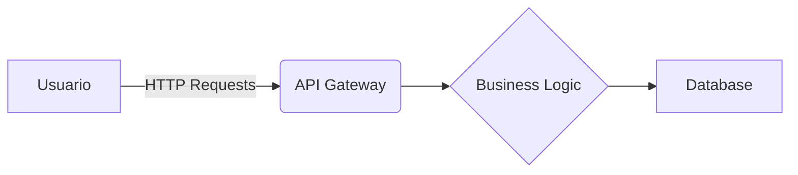
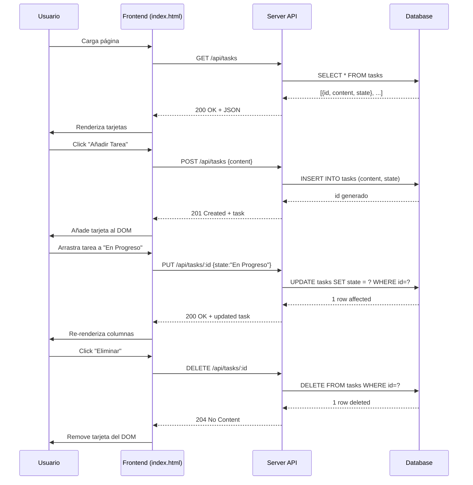

# Visión General del Proyecto
Kanban Mini‑Trello es una aplicación web ligera que permite gestionar tareas en un tablero Kanban con tres columnas: **Por Hacer**, **En Progreso** y **Hecho**.  
El front‑end está construido únicamente con HTML, Bootstrap 5 y JavaScript puro, lo que facilita su despliegue sin dependencias adicionales. La capa de datos se expone a través de una API REST simple (`/api/tasks`) que soporta operaciones CRUD y el cambio de estado de las tareas mediante `PUT`.  

El flujo típico es:

1. Al cargar la página, el cliente hace un **GET** a `/api/tasks` para obtener todas las tareas almacenadas.
2. El usuario puede crear una nueva tarea (prompt → POST), editar su contenido (click → PUT) o eliminarla (botón → DELETE).
3. Para mover una tarea entre columnas se dispara un `drag‑and‑drop`; el cliente envía un **PUT** con el nuevo estado y la API actualiza la base de datos.

El proyecto está pensado para ser desplegado en cualquier servidor que soporte Node.js/Express o cualquier stack backend compatible, ya que solo consume HTTP endpoints estándar.

---

# Arquitectura del Sistema
La arquitectura sigue un patrón clásico **Cliente‑Servidor**:



## Componentes

| Componente | Descripción |
|------------|-------------|
| **Front‑end** | `index.html` + scripts. Renderiza el tablero y gestiona interacciones de usuario. |
| **API Gateway** | Punto único de entrada (`/api/tasks`). Implementado en Express (no incluido en el dump, pero se asume). |
| **Business Logic** | CRUD sobre la entidad *Task* y manejo del estado. |
| **Database** | Persistencia simple (SQLite / JSON file / MongoDB). Se espera un esquema con campos `id`, `content` y `state`. |

---

# Endpoints de la API

| Método | Ruta | Parámetros | Cuerpo | Respuesta | Descripción |
|--------|------|------------|--------|-----------|-------------|
| **GET** | `/api/tasks` | - | - | `200 OK`<br>`[{id, content, state}]` | Devuelve todas las tareas. |
| **POST** | `/api/tasks` | - | `{content: string}` | `201 Created`<br>`{id, content, state:"Por Hacer"}` | Crea una nueva tarea con estado por defecto. |
| **PUT** | `/api/tasks/:id` | `id` (path) | `{content?: string, state?: string}` | `200 OK`<br>`{id, content, state}` | Actualiza contenido y/o estado de la tarea. |
| **DELETE** | `/api/tasks/:id` | `id` (path) | - | `204 No Content` | Elimina la tarea especificada. |

> **Nota:** Los endpoints usan JSON para el cuerpo y respuesta; los clientes deben incluir `Content-Type: application/json`.

---

# Instrucciones de Instalación y Ejecución

1. **Clonar el repositorio**  
   ```bash
   git clone https://github.com/tu-usuario/kanban-mini-trello.git
   cd kanban-mini-trello
   ```

2. **Instalar dependencias del backend (Node.js + Express)**  
   ```bash
   npm install express body-parser cors sqlite3
   ```

3. **Crear la base de datos** (ejemplo con SQLite)  
   ```bash
   npx sqlite3 db.sqlite < schema.sql
   ```

4. **Iniciar el servidor**  
   ```bash
   node server.js
   ```
   El servidor escuchará en `http://localhost:3000`.

5. **Abrir la aplicación**  
   Navega a `http://localhost:3000` en tu navegador.

---

# Flujo de Datos Clave



---

# Extensiones Futuras (Opcional)

| Área | Posible Mejora |
|------|----------------|
| **Persistencia** | Migrar a una base de datos relacional completa (PostgreSQL) con migraciones automatizadas. |
| **Autenticación** | Añadir JWT para proteger la API y permitir usuarios múltiples. |
| **Colaboración en tiempo real** | Implementar WebSocket / Socket.io para sincronizar cambios entre clientes simultáneos. |
| **Persistencia del estado de drag‑and‑drop** | Guardar la posición exacta (orden) de las tareas dentro de cada columna. |
| **UI/UX** | Reemplazar prompts por modales Bootstrap y añadir filtros/etiquetas a las tareas. |

---