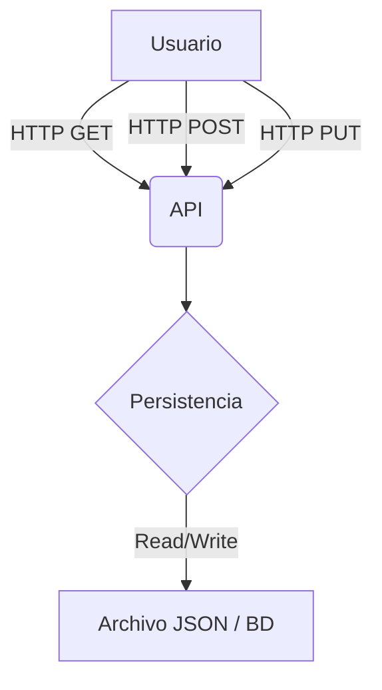

# Mini‑Trello Kanban

## Visión General del Proyecto
Mini‑Trello es una aplicación web ligera que permite gestionar tareas en un tablero Kanban con tres columnas: **Por Hacer**, **En Progreso** y **Hecho**. La interfaz está construida con Bootstrap 5 para un diseño responsivo y minimalista, mientras que la lógica de negocio se delega a una API REST sencilla (`/api/tasks`) que expone los endpoints necesarios para crear, leer y actualizar tareas.

El flujo típico es el siguiente:
1. Al cargar la página, el cliente solicita todas las tareas con `GET /api/tasks`.
2. El usuario puede añadir nuevas tareas desde el formulario de la columna “Por Hacer” (`POST /api/tasks`).
3. Cada tarjeta se puede editar haciendo clic en ella o moverla entre columnas arrastrándola y soltándola; ambos casos disparan una petición `PUT /api/tasks/:id`.

El proyecto está pensado para ser desplegado con cualquier servidor HTTP que sirva archivos estáticos y un backend ligero (Node.js, Python Flask, etc.). La arquitectura se describe a continuación.

## Arquitectura del Sistema
```
┌─────────────────────┐          ┌───────────────────┐
│  Navegador Web      │<--------►│   API REST        │
│  (index.html + JS)  │   HTTP    │  (/api/tasks)     │
└─────────────────────┘          └───────────────────┘
```

### Componentes Principales

| Componente | Responsabilidad |
|------------|-----------------|
| **Frontend** | Renderiza el tablero Kanban, gestiona eventos de drag‑and‑drop y realiza peticiones HTTP a la API. |
| **API REST** | Expose CRUD sobre tareas: `GET /api/tasks`, `POST /api/tasks`, `PUT /api/tasks/:id`. Almacena datos en memoria o en una base de datos ligera (JSON, SQLite). |
| **Persistencia** | Opcionalmente puede ser un fichero JSON o una BD relacional; la API se encarga de serializar/deserialize. |

### Diagrama Mermaid


## Endpoints de la API

| Método | Ruta | Parámetros | Descripción | Respuesta |
|--------|------|------------|-------------|-----------|
| `GET` | `/api/tasks` | ninguno | Obtiene todas las tareas. | `{ tasks: [ {id, content, state} ] }` |
| `POST` | `/api/tasks` | JSON `{content}` | Crea una nueva tarea con estado **Por Hacer**. | `{ id, content, state: "Por Hacer" }` |
| `PUT` | `/api/tasks/:id` | URL param `id`, body JSON (`{content?, state?}`) | Actualiza la tarea identificada; puede cambiar contenido y/o estado. | `{ id, content, state }` |

### Ejemplo de Respuesta
```json
{
  "tasks": [
    { "id": 1, "content": "Revisar PR", "state": "Por Hacer" },
    { "id": 2, "content": "Implementar login", "state": "En Progreso" }
  ]
}
```

## Instrucciones de Instalación y Ejecución

1. **Clonar el repositorio**  
   ```bash
   git clone https://github.com/tu-usuario/minitrello.git
   cd minitrello
   ```

2. **Instalar dependencias del backend (ejemplo con Node.js + Express)**  
   ```bash
   npm install express cors body-parser
   ```

3. **Crear el archivo de datos** (`tasks.json`) en la raíz con contenido inicial:  
   ```json
   []
   ```

4. **Iniciar el servidor**  
   ```bash
   node server.js
   ```
   El servidor escuchará en `http://localhost:3000`.

5. **Abrir la aplicación**  
   Navega a `http://localhost:3000/index.html` (o simplemente abre el archivo local si sirves los archivos estáticos con un servidor HTTP).

> **Nota:** Si prefieres usar Python Flask, sustituye los pasos 2‑4 por:
> ```bash
> pip install flask flask-cors
> python app.py
> ```

## Flujo de Datos Clave

1. **Carga Inicial**  
   - `GET /api/tasks` → Lista de tareas → Renderizado en columnas según `state`.

2. **Creación**  
   - Usuario escribe en el formulario → `POST /api/tasks` con `{content}` → API devuelve tarea completa (incluye `id`, `state`) → Se crea tarjeta en la columna “Por Hacer”.

3. **Edición de Contenido**  
   - Click en tarjeta → Prompt → `PUT /api/tasks/:id` con `{content}` → Tarjeta actualizada.

4. **Cambio de Estado (Drag‑and‑Drop)**  
   - Drag start → ID enviado por `dataTransfer`.  
   - Drop en columna → Se llama a `PUT /api/tasks/:id` con `{state: newState}` → API devuelve tarea actualizada → Tarjeta se mueve a la nueva columna.

5. **Persistencia**  
   - Cada operación de POST/PUT escribe el estado actualizado en el fichero o BD, garantizando que al recargar la página los datos sean consistentes.

## Extensiones Futuras (Opcional)

| Área | Idea | Beneficio |
|------|------|-----------|
| **Autenticación** | Añadir JWT y login para usuarios. | Permite personalizar tableros por usuario. |
| **Etiquetas & Prioridades** | Campos adicionales `tags`, `priority`. | Mejora la organización visual. |
| **Notificaciones** | WebSocket o SSE para actualizaciones en tiempo real. | Evita recargas manuales y mejora UX. |
| **Persistencia Relacional** | Migrar de JSON a SQLite/PostgreSQL. | Escalabilidad y consultas complejas. |
| **Export/Import** | Exportar tablero a CSV/JSON, importar tareas. | Facilita la migración entre entornos. |
| **Temas** | Cambiar esquema de colores mediante CSS variables. | Personalización del UI. |

---