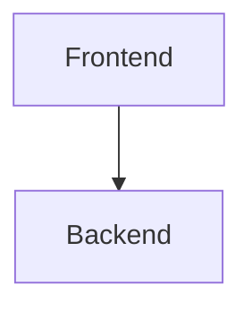

# Visión General del Proyecto

El proyecto es una aplicación web simple que implementa un tablero Kanban, permitiendo a los usuarios gestionar tareas en diferentes estados: "Por Hacer", "En Progreso" y "Hecho". La interfaz de usuario está construida utilizando HTML5 y Bootstrap 5 para garantizar una experiencia visual atractiva y responsiva. El frontend se comunica con un backend mediante solicitudes HTTP, utilizando Fetch API para interactuar con los endpoints RESTful que manejan la creación, actualización, eliminación y obtención de tareas.

# Arquitectura del Sistema

El sistema está compuesto por dos componentes principales: el frontend y el backend. Aunque el contexto proporcionado solo incluye el código fuente del frontend (index.html), se puede inferir que el backend probablemente sea una API RESTful implementada en un lenguaje como Node.js, Python o Java.

## Diagrama de Componentes



## Endpoints de la API

A continuación se presentan los endpoints de la API utilizados por el frontend:

| Endpoint       | Método | Descripción                                |
|----------------|--------|--------------------------------------------|
| `/api/tasks`   | GET    | Obtiene todas las tareas.                 |
| `/api/tasks`   | POST   | Crea una nueva tarea.                      |
| `/api/tasks/:id`| PUT  | Actualiza el estado de una tarea existente. |
| `/api/tasks/:id`| DELETE | Elimina una tarea existente.               |

# Instrucciones de Instalación y Ejecución

1. **Clonar el Repositorio:**
   ```bash
   git clone <URL_DEL_REPOSITORIO>
   cd nombre-del-proyecto
   ```

2. **Instalar Dependencias del Backend (si es necesario):**
   ```bash
   npm install # o yarn install, dependiendo de la configuración
   ```

3. **Iniciar el Servidor Backend:**
   ```bash
   npm start # o yarn start, dependiendo de la configuración
   ```

4. **Abrir el Proyecto en un Navegador Web:**
   ```
   Abre http://localhost:3000 (o el puerto configurado) en tu navegador.
   ```

# Flujo de Datos Clave

1. **Carga Inicial:**
   - El frontend solicita todas las tareas al backend mediante una solicitud GET a `/api/tasks`.
   - El backend responde con la lista de tareas, que el frontend renderiza en las columnas correspondientes.

2. **Creación de Tarea:**
   - Cuando un usuario ingresa una nueva tarea y envía el formulario, el frontend envía una solicitud POST a `/api/tasks` con los detalles de la tarea.
   - El backend crea la tarea y responde con los datos actualizados.
   - El frontend actualiza la interfaz para mostrar la nueva tarea.

3. **Actualización de Tarea:**
   - Cuando un usuario arrastra y suelta una tarea entre columnas, el frontend envía una solicitud PUT a `/api/tasks/:id` con el nuevo estado de la tarea.
   - El backend actualiza el estado de la tarea y responde.
   - El frontend refresca la interfaz para mostrar la tarea en la nueva columna.

4. **Eliminación de Tarea:**
   - Cuando un usuario hace clic en el botón "Eliminar" de una tarea, el frontend envía una solicitud DELETE a `/api/tasks/:id`.
   - El backend elimina la tarea y responde.
   - El frontend actualiza la interfaz para eliminar la tarea.

# Extensiones Futuras

1. **Autenticación y Autorización:**
   - Implementar un sistema de autenticación para permitir que múltiples usuarios accedan al tablero Kanban.
   - Controlar el acceso a las tareas basado en roles o permisos específicos.

2. **Persistencia de Datos Mejorada:**
   - Utilizar una base de datos más robusta (como MongoDB, PostgreSQL) para almacenar las tareas y asegurar la persistencia de los datos.
   - Implementar transacciones y validaciones adicionales.

3. **Notificaciones en Tiempo Real:**
   - Utilizar WebSockets o un servicio de mensajería como Socket.IO para notificar a los usuarios sobre cambios en el tablero Kanban en tiempo real.

4. **Historial de Cambios:**
   - Registrar y mostrar el historial de cambios de cada tarea, incluyendo quién realizó la acción y cuándo.
   - Proporcionar una vista detallada del historial para facilitar el seguimiento de las tareas.